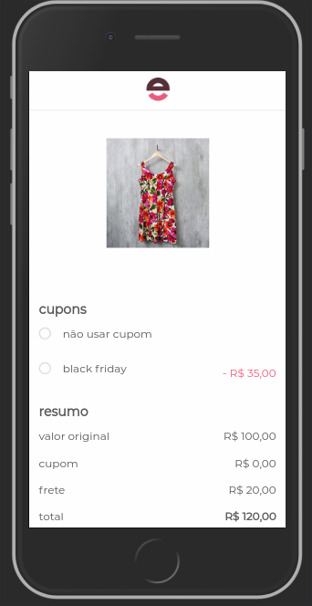

# Test Front end Enjoei! =)
Teste técnico de Front para a empresa Enjoei, desenvolvido com ReactJS, toda parte de designer foi com o matérial disponível em server resource, a primeira demo do design foi criada no code.pen, veja a demo [clicando aqui!](https://codepen.io/alexandrejuk/pen/ZVGzqr)

# Requerido
* ReactJS
* npm
* node

## Como usar
1. clone o repositório: [git@github.com:alexandrejuk/enjoei-test.git](git@github.com:alexandrejuk/enjoei-test.git) 
2. cd enjoei-test
3. cd server
4. npm install
5. npm start (executa a aplicação do Servidor)
6. repetir o passos anteriores para os arquivos da pasta client

## ScreenShot

## Autor
[Alexandre dos Santos Soares](https://github.com/alexandrejuk)
